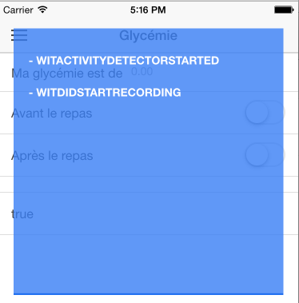

#cordova-plugin-wit

This plugin is a wrapper of [wit.ai](https://wit.ai/) ios framework, to use in a cordova application

#Installation

```shell
cordova plugin add https://github.com/AdFabConnect/cordova-plugin-wit.git
```

#Supported Platforms

- iOS
- browser

#Methods

- WitCdv.init
- WitCdv.toggleCaptureVoiceIntent
- WitCdv.version

Init method example :

```javascript
/**
 * Init method
 * @param (String) token wit
 * @param (function) callback
 * @param (bool) debug mode OPTIONAL
 */
 WitCdv.init(' YOUR WIT TOKEN ',
 	/**
 	 * @param (Object) e {value: '', action: ''}
 	 * action : 'witDidGetAudio', 'intent', 'witActivityDetectorStarted', 'witDidStartRecording', 'witDidStopRecording'
 	 */
	function(e) {
		// e.action
		// e.value
	},
	DEBUG
);
```
 
find your token [here](https://wit.ai/home)

if debug = true



###Possible callback value For ios

- **action**: witDidGetAudio, **value**: Int
- **action**: witActivityDetectorStarted, **value**: NULL
- **action**: witDidStartRecording, **value**: NULL
- **action**: witDidStopRecording, **value**: NULL
- **action**: intent, **value**: Object

###Possible callback value For browser

- **action**: "witReady", **value**: String
- **action**: "witDidStartRecording", **value**: String
- **action**: "witDidStopRecording", **value**: String
- **action**: "witDidStopRecording", **value**: Object
- **action**: "error", **value**: String
- **action**: "connecting", **value**: String
- **action**: "notconnecting", **value**: String

Intent obect value

```json
[
  {
    "_text" : " TRUE SPEACH VALUE ",
    "entities" : {

    },
    "confidence" : 0.285,
    "intent" : "BEST_MATCH_INTENT"
  }
]
```

toggleCaptureVoiceIntent method example :

```javascript
WitCdv.toggleCaptureVoiceIntent()
```
